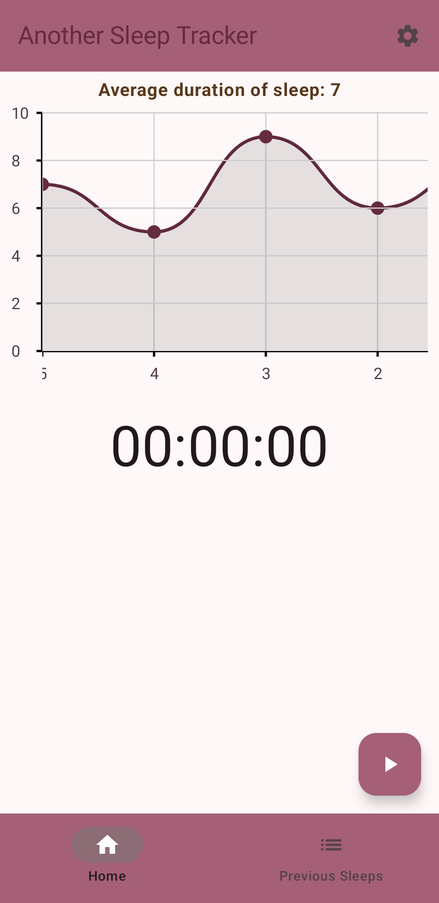
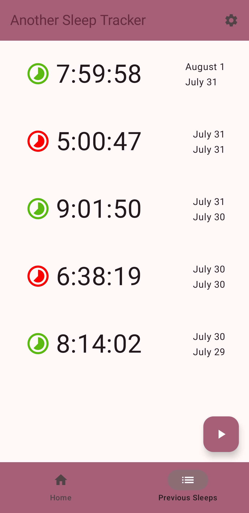
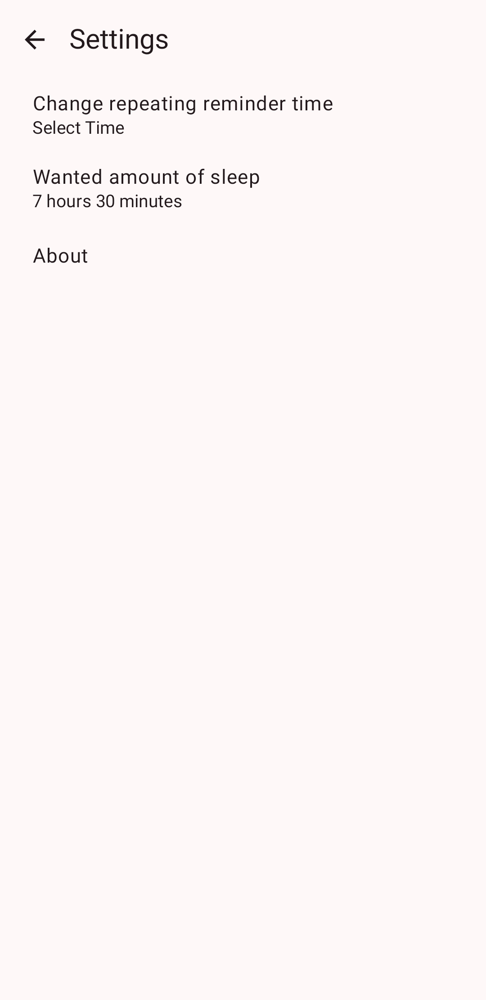
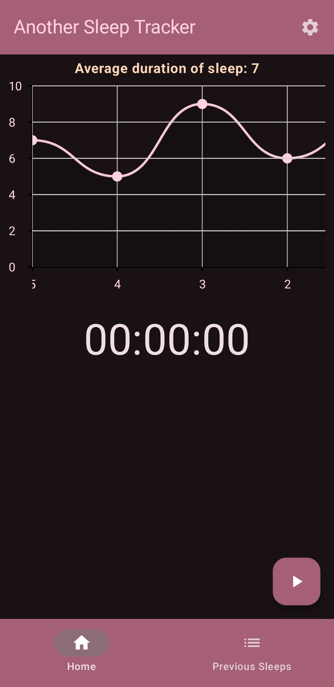
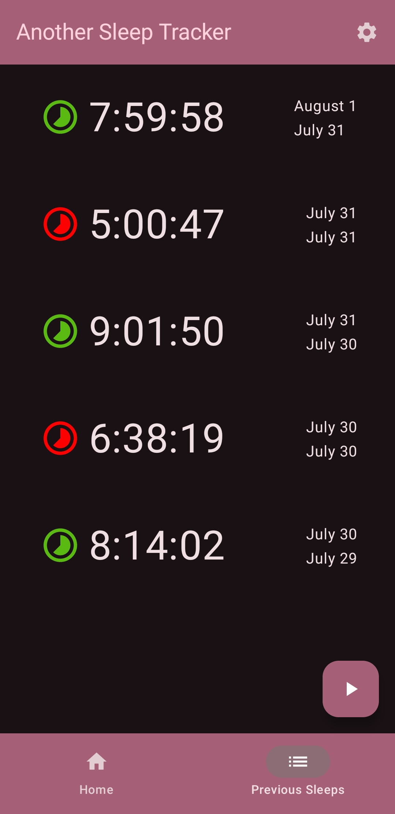

#  Another Sleep Tracker

Another Sleep Tracker is a simple time-based sleep tracker for Android.

## Installing
Go to the "Releases" menu, click the latest version, then download the .apk.

## Permissions
Another Sleep Tracker has an optional notification permission for sending reminder notifications.

## Licenses
Another Sleep Tracker is licensed under MPL 2.0.
